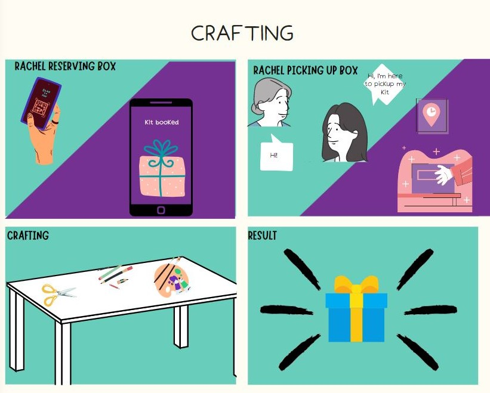
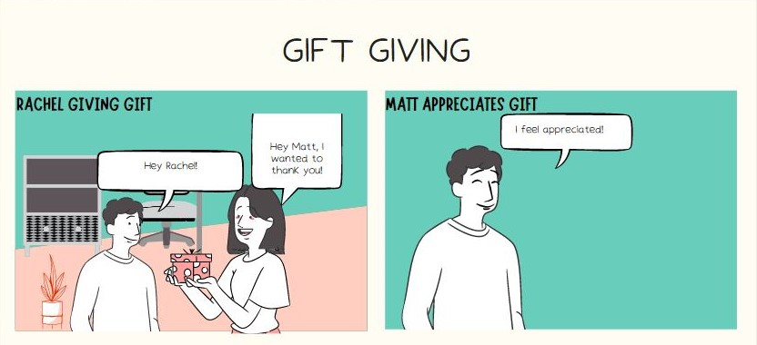

##  Personas

### Primary Persona
 

### Secondary Persona

## Goals

| | Build a support system to help her achieve success |
| | Build stronger connections to combat loneliness from moving | 
| | Express more gratitude as a way of building more meaningful connections |

## Scenario
Rachel has a huge test coming up and is feeling stressed. She's been studying for a long time but is stuck on one problem and is starting to feel overwhelmed. To help with the problem, she asks a classmate for help the classmate was able to explain the problem in a way that made sense to Rachel. She is very thankful for the classmate's help and wants a way to express her gratitude in a more meaningful way but she doesn't know how to do so. She also thinks this is a perfect opportunity to deepen her connection with the classmate.  

## Storyboard

  

 
 
 
