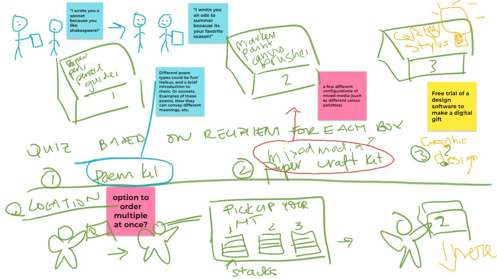
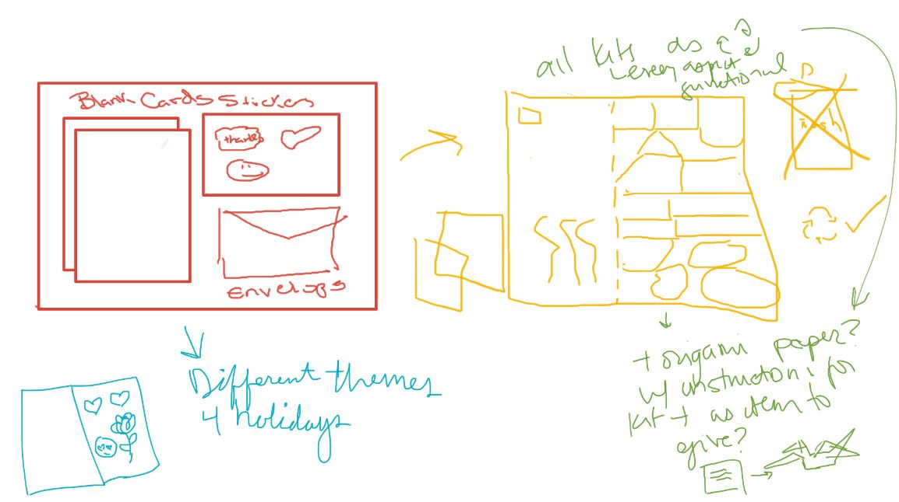

## Problem Statement 
Of the 1.4 million students who study at Canadian Universities, 10% move provinces to, and  another 10% originate from outside of Canada. These students often relocate with a limited or non-existent social, professional, or other type of network in their new city 
This can lead to feelings of isolation contributing to higher levels of mental illness, poor university experience, academic performance, attrition,
Expressions of gratitude can help nurture community and help form deep and meaningful connections - absolving such feelings of isolation and subsequent effects.
In this project we design a solution which helps lower social barriers, allowing for more gratitude sharing between students to foster community and minimize feelings of isolation. 


## Formative evaluation 
Provide a brief summary of your formative evaluation process and findings. Brainsketching activity may come of use here. 


During a Brain Sketching exercise was really where a lot of our formative ideas and feedback took place. With the exercise, each of us created an idea and direction for our design and then collaboratively added onto and improved each design. Through this exercise, we could plainly see where each individual member was coming from conceptually and we were able to give real-time feedback that allowed each member to hone in on an effective and more developed idea. A lot of the inspiration for our final kit ideas came from this brain sketching exercise. 
<center>
|||
|||

</center>

<center>

</center>


## Persona

Primary Persona | Secondary Persona
- | - 
 


<!-- ### Rachel Jones


### Matt Tores 
 -->

## Goals

| | Build a support system to help her achieve success |
| | Build stronger connections to combat loneliness from moving | 
| | Express more gratitude as a way of building more meaningful connections |

## Tasks / Scenario
Rachel has a huge test coming up and is feeling stressed. She's been studying for a long time but is stuck on one problem and is starting to feel overwhelmed. To help with the problem, she asks a classmate for help the classmate was able to explain the problem in a way that made sense to Rachel. She is very thankful for the classmate's help and wants a way to express her gratitude in a more meaningful way but she doesn't know how to do so. She also thinks this is a perfect opportunity to deepen her connection with the classmate.  

## Storyboard

<!--   -->

<p align="center">
  
</p>

 
 
 


## Prototype Overview 

<p align="center">
    <iframe src="https://drive.google.com/file/d/1zbFgkbNtg9CUVSIF90UJNzPfqLrt9HoD/preview" width="640" height="480" allow="autoplay"></iframe>
</p>

The prototype product is a selection of physical kits that users can order online, pick up, and craft at home or within a workshop space. Based on user selection, the kits contain items from a wide range of ordinary hand-crafting tools and materials such as scissors, glues, cutting papers, stickers, and gift wraps. The considerations behind this design are to make it cheap, affordable, eco-friendly, easy to use while providing great customizable for users to apply their creativity and personal preference. The fun and collaborative culture of casual crafting combined with its dedicated, innovative incentive should have the effect of mitigating social awkwardness, increasing bond, and deliver the intended gratitude in an always personal and unique way.
It is important to keep in mind that the video prototype represents the horizontal design of our product at an earlier point which only demonstrates an envisioned process of use. The actual product features and services will be actualized and diversified in our redesign stage. 


## Feedback 
Briefly describe how the prototype was evaluated and highlight key findings, especially any that were surprising or went against your expectations. Being able to interpret the findings and select which are most useful to share is as important as being able to collect the data in the first place.
<style>
td, th {
   border: none!important;
}
</style>


 
- Confusion as to the content of the kit. Many participants were unclear on the contents and variations of the kit, and worried there weren’t options that would relate to their own ways of expressing gratitude.
- Kit suggestions were solicited, in the hopes of ensuring we could cover a wider range of products. This also informed our v2 Prototype, which covers a wider array of domains.
    - We had hoped including multiple products in the video was enough to showcase different kits, but our prototype was not clear.
- Some users we interviewed pushed back against the idea in its entirety – they considered it a “silly idea” that they would never use. When asked for clarification, they explained that it was contrary to their own ideas about expressing gratitude, and that they wouldn’t require help. Given that our target users were those who had trouble expressing gratitude, this seems to affirm who we aren’t targeting. 


## Redesign 
Present the next progression of your design idea. Note that we are cutting our iterative process off at this stage and keeping it brief. You should use this design phase to articulate how your evaluation findings are moving forward your design thinking. You do not need to build out an entire interface.


| ||
| | |


<!-- <p align="center">
  
</p> -->


## Concluding thoughts and future work 

<!-- ## Welcome to GitHub Pages

You can use the [editor on GitHub](https://github.com/sriGanna/GratitudeKits/edit/gh-pages/index.md) to maintain and preview the content for your website in Markdown files.

Whenever you commit to this repository, GitHub Pages will run [Jekyll](https://jekyllrb.com/) to rebuild the pages in your site, from the content in your Markdown files.

### Markdown

Markdown is a lightweight and easy-to-use syntax for styling your writing. It includes conventions for

```markdown
Syntax highlighted code block

# Header 1
## Header 2
### Header 3

- Bulleted
- List

1. Numbered
2. List

**Bold** and _Italic_ and `Code` text

[Link](url) and 
```

For more details see [Basic writing and formatting syntax](https://docs.github.com/en/github/writing-on-github/getting-started-with-writing-and-formatting-on-github/basic-writing-and-formatting-syntax).

### Jekyll Themes

Your Pages site will use the layout and styles from the Jekyll theme you have selected in your [repository settings](https://github.com/sriGanna/GratitudeKits/settings/pages). The name of this theme is saved in the Jekyll `_config.yml` configuration file.

### Support or Contact

Having trouble with Pages? Check out our [documentation](https://docs.github.com/categories/github-pages-basics/) or [contact support](https://support.github.com/contact) and we’ll help you sort it out. -->
