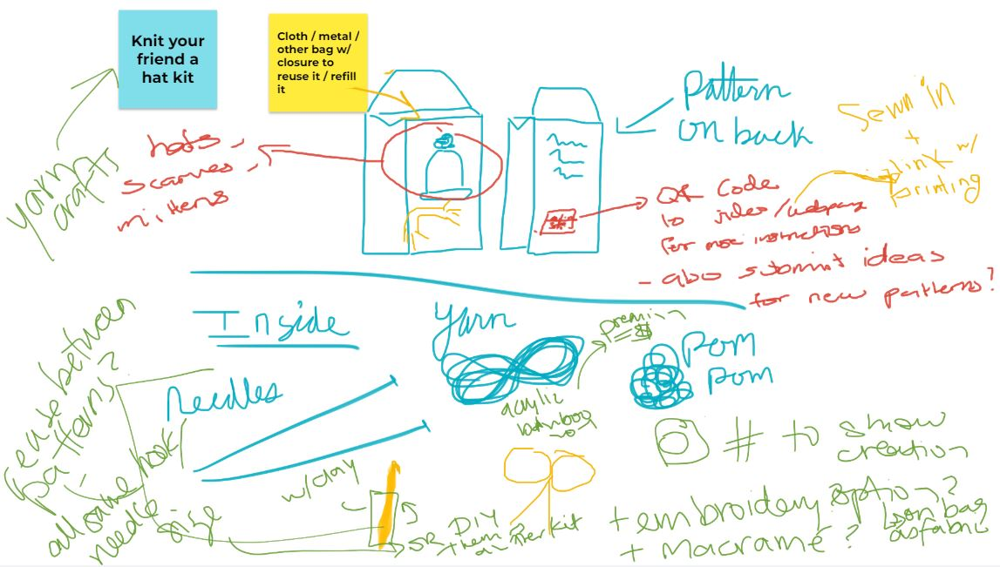
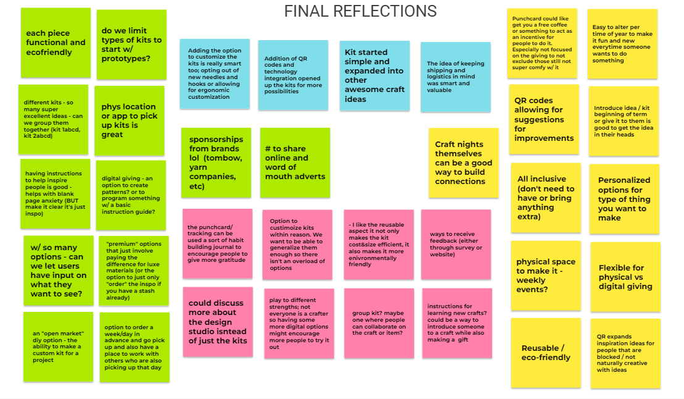
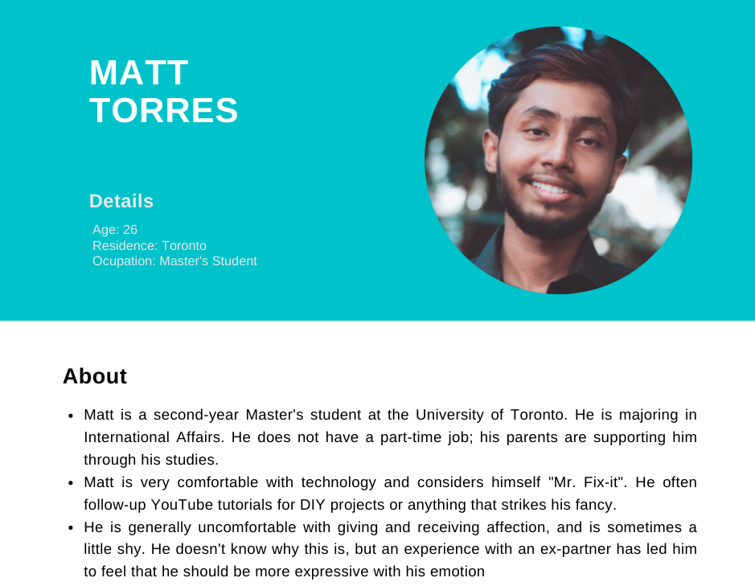

<link rel="stylesheet" href="./index_styles.scss">

##  Problem Statement 

Of the 1.4 million students who study at Canadian Universities, 10% move provinces to, and  another 10% originate from outside of Canada. These students often relocate with a limited or non-existent social, professional, or other type of network in their new city 
This can lead to feelings of isolation contributing to higher levels of mental illness, poor university experience, academic performance, attrition,
Expressions of gratitude can help nurture community and help form deep and meaningful connections - absolving such feelings of isolation and subsequent effects.

__In this project we designed a solution which helps lower social barriers, allowing for more gratitude sharing between students to foster community and minimize feelings of isolation.__

&nbsp;
&nbsp;
&nbsp;

&nbsp;

##  Formative evaluation 

During a Brain Sketching exercise was really where a lot of our formative ideas and feedback took place. With the exercise, each of us created an idea and direction for our design and then collaboratively added onto and improved each design. Through this exercise, we could plainly see where each individual member was coming from conceptually and we were able to give real-time feedback that allowed each member to hone in on an effective and more developed idea. A lot of the inspiration for our final kit ideas came from this brain sketching exercise. 

|||
|||

  

&nbsp;
&nbsp;
&nbsp;
&nbsp;

##  Personas

### Primary Persona: The person who would be using the gratitude solution

 

### Secondary Persona: The person who would be on the receiving end of the solution

## Goals

| | Build a support system to help her achieve success |
| | Build stronger connections to combat loneliness from moving | 
| | Express more gratitude as a way of building more meaningful connections |

## Scenario
Rachel has a huge test coming up and is feeling stressed. She's been studying for a long time but is stuck on one problem and is starting to feel overwhelmed. To help with the problem, she asks a classmate for help the classmate was able to explain the problem in a way that made sense to Rachel. She is very thankful for the classmate's help and wants a way to express her gratitude in a more meaningful way but she doesn't know how to do so. She also thinks this is a perfect opportunity to deepen her connection with the classmate.  

## Storyboard

<!-- 

  

 -->

  

&nbsp;

&nbsp;

 
 
 

&nbsp;

&nbsp;

##  Prototype Overview 

The prototype product is a selection of physical kits that users can order online, pick up, and craft at home or within a workshop space. Based on user selection, the kits contain items from a wide range of ordinary hand-crafting tools and materials such as scissors, glues, cutting papers, stickers, and gift wraps. The considerations behind this design are to make it cheap, affordable, eco-friendly, easy to use while providing great customizable for users to apply their creativity and personal preference. The fun and collaborative culture of casual crafting combined with its dedicated, innovative incentive should have the effect of mitigating social awkwardness, increasing bond, and deliver the intended gratitude in an always personal and unique way.
It is important to keep in mind that the video prototype represents the horizontal design of our product at an earlier point which only demonstrates an envisioned process of use. The actual product features and services will be actualized and diversified in our redesign stage. 

    <iframe src="https://drive.google.com/file/d/1zbFgkbNtg9CUVSIF90UJNzPfqLrt9HoD/preview" width="640" height="480" allow="autoplay"></iframe>

&nbsp;

&nbsp;

&nbsp;

##  Feedback 

 
- Confusion as to the content of the kit. Many participants were unclear on the contents and variations of the kit, and worried there weren’t options that would relate to their own ways of expressing gratitude.
- Kit suggestions were solicited, in the hopes of ensuring we could cover a wider range of products. This also informed our v2 Prototype, which covers a wider array of domains.
    - We had hoped including multiple products in the video was enough to showcase different kits, but our prototype was not clear.
- Some users we interviewed pushed back against the idea in its entirety – they considered it a “silly idea” that they would never use. When asked for clarification, they explained that it was contrary to their own ideas about expressing gratitude, and that they wouldn’t require help. Given that our target users were those who had trouble expressing gratitude, this seems to affirm who we aren’t targeting. 

&nbsp;
&nbsp;
&nbsp;
&nbsp;

##  Redesign 

The original focus was on traditional crafting kits, such as drawing, sticker-making, painting, and cards. Given the feedback from potential users that it was quite limited and felt it was limited to just ‘crafters’ and excluded other forms of expression and gratitude. 
Given this feedback we’ve expanded out kit selections to a much broader sense of “hand made” to include different versions and concepts of creativity. These lend themselves to a more inclusive set of gratitude gift kits 

### Original Kits

| | | | |

### New Kits

|||
| | |

&nbsp;
&nbsp;
&nbsp;
&nbsp;

##  Concluding thoughts and future work 

### Looking Forward

Some areas we would like to include in future interactions of this design progroject include:
1. User interviews and input for those with disabilities or accessibility concerns on how we can make both the kits themselves as well as the process of ordering, picking up, and making more inclusive 
2. Currently kits are designed for those at a beginner or intermediate level of the craft itself, we would want to expand to accommodate those at a more advanced skill level
3. Improve the usability of the ordering app, and include additional functionality including feedback or reviews for each of the kits.

### Conclusions

<!-- |  | This design has been a chance to be a part of a collaborative process that emphasizes how gratitude plays a role in our lives, and how we can cultivate and express more of it in our daily lives and in our relationships, both new and old. It was an interesting opportunity to explore and understand how others view gratitude and where they’re excelling in or lacking in gratitude and how to try and emphasize or mitigate those factors respectively.| -->

<!-- 
&nbsp;
&nbsp; -->

<!-- | Going through an entire user-centered design cycle - or nearly - from ideation to prototyping has really shown how different everyone is. Both in how people define gratitude, but also how they see solutions to improving it. The one constant that seemed nearly universal, was the importance of gratitude in our lives, and we as designers has the opportunity to try to figure out how to exemplify that in our solution |  |

&nbsp;
&nbsp;

|  | Applying the design process to this project, for me, really emphasized the  importance of diversity of thought. Especially in the early phases of the design cycle, the diversity allowed us to explore ideas & avenues that no single person in our team could have come up with on their own. |

| Being able to work on a project from a vague prompt to the prototyping phase was incredibly rewarding. Seeing an idea grow as we all contributed our own perspectives and experiences, being able to conduct user testing, and challenging our own preconceived notions was informative and tremendously fun, and something I will continue to apply in other projects. |  |

 -->

